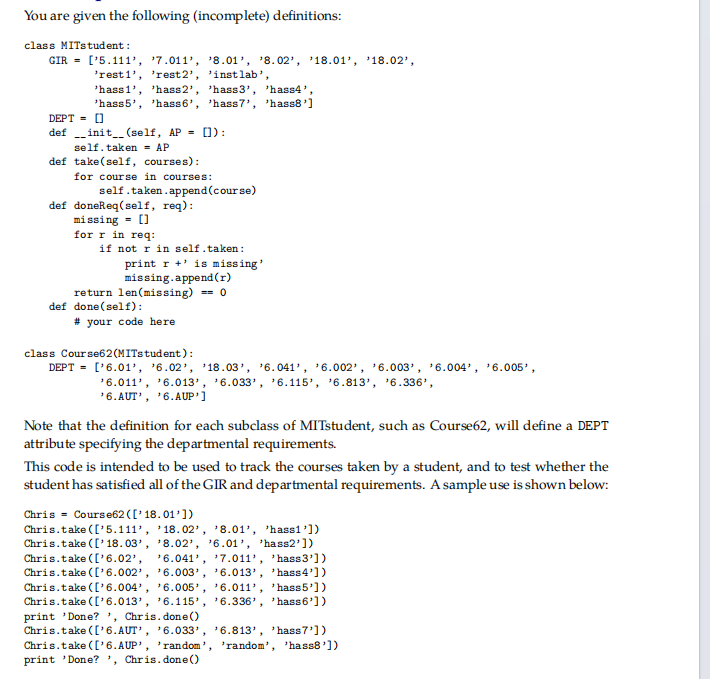
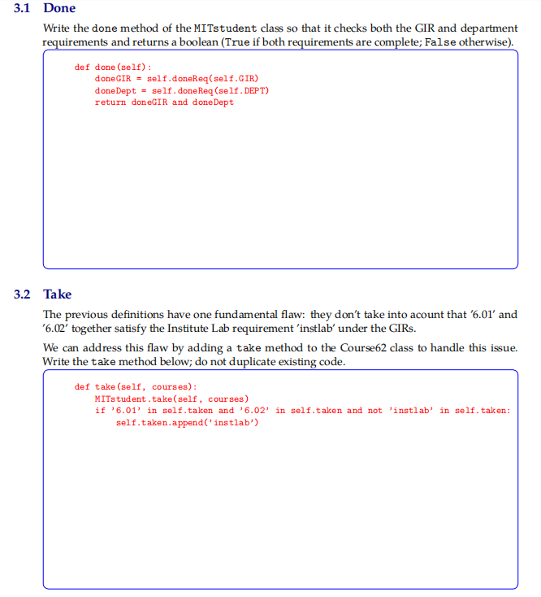
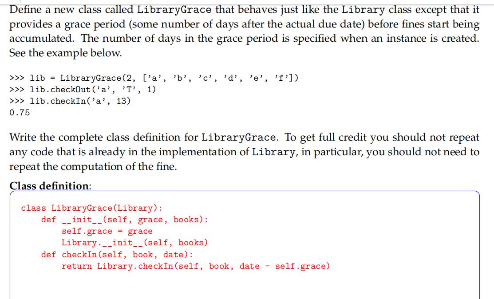
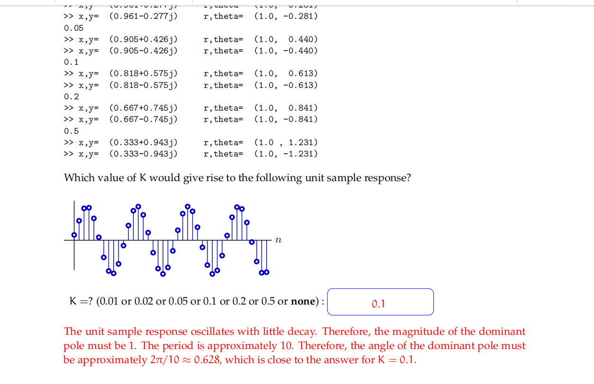
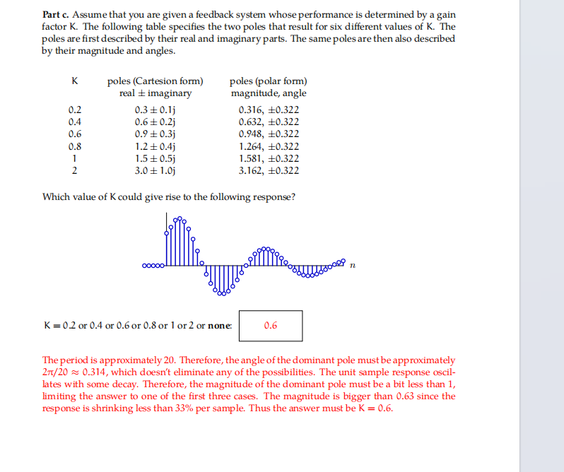
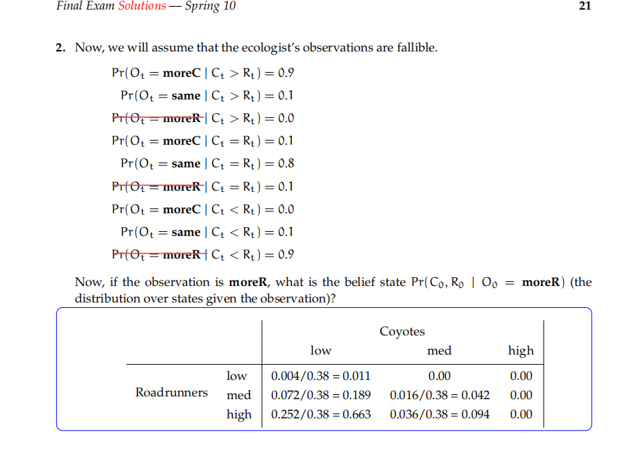

# OOP

## 1.类的属性与实例的属性

定义在init方法里面的是实例的属性，定义在整个类里面的是整个类(实例公用)的属性

## 2.self的初始化问题

如果一个具体实例如student1,则会自动传入参数self,如student1.take(courses)
如果要运行一个没有产生实例的类的话，self参数还需要写进去，如MITstudent.take(self, courses)

> ### 1. “解绑方法” (Unbound Method) 的概念
>
> 在 Python 中，同一个方法有两种存在状态：
>
> - **绑定方法 (Bound Method)：** 当你通过实例调用时（如 `student1.take()`），Python 会自动把 `student1` 作为第一个参数传给 `self`。
>
> - 
>
>   **解绑方法 (Unbound Method)：** 当你直接通过类名调用时（如 `MITstudent.take()`），它就像一个普通的函数。因为它没有绑定任何具体的实例，所以你必须**手动**传入一个实例（即 `self`），告诉它“请在这个具体的学生对象上执行这段代码” 。
>
>   +2
>
>   
>
> ### 2. 这里的 `MITstudent` 扮演了“说明书”的角色
>
> 你可以把类想象成一本“操作说明书”：
>
> - 
>
>   `MITstudent.take(self, courses)` 的意思实际上是：“去查阅 `MITstudent` 这本说明书里关于 `take` 动作的原始定义，并将其应用到当前的 `self` 实例上” 。
>
>   +1
>
>   
>
> - 因为 `Course62` 是 `MITstudent` 的子类，所以 `Course62` 的实例完全符合 `MITstudent` 说明书的要求 。
>
>   +2
>

> ### . 技术原因：子类会“覆盖”父类的初始化方法
>
> 在 Python 中，如果子类定义了自己的 `__init__` 方法，它会**覆盖（Override）掉父类的 `__init__` 方法。这意味着父类中的初始化逻辑不会**自动执行 。
>
> +1
>
> 
>
> 如果在 `LibraryGrace` 的 `__init__` 中不调用父类的初始化方法，那么：
>
> - 父类中定义的 `self.shelf = {}` 这行代码将永远不会被执行 。
>
>   
>
>   
>
> - 结果是，`LibraryGrace` 的实例将没有 `shelf`（书架）这个属性。
>
> ### 2. 逻辑原因：确保基础数据结构存在
>
> 
>
> `LibraryGrace` 继承了父类的 `checkOut`、`checkIn` 和 `overdueBooks` 等方法 。这些方法全都依赖于 `self.shelf` 字典来存取数据 。
>
> +4
>
> 
>
> - **后果**：如果你不进行父类初始化，当你尝试调用 `lib_grace.checkOut(...)` 时，程序会直接报错 `AttributeError: 'LibraryGrace' object has no attribute 'shelf'`。因为程序找不到存储书籍信息的地方。
>
> ### 3. 符合“最小化修改”和“代码复用”原则
>
> 题目要求“不要重复任何已经存在于 `Library` 中的代码” 。
>
> 
>
> - 通过调用 `Library.__init__(self, books)`，你直接复用了父类中“将书名列表转化为字典”的逻辑 。
>
>   
>
>   
>
> - 如果不调用它，你就得在子类里重新写一遍遍历书名并存入字典的代码，这违反了 DRY（Don't Repeat Yourself）原则。
>
> ### 总结

list comprehension是列表推导器

# 状态机

# 信号与系统

## 系统图

### 1.写差分方程的递归公式

### 2.写系统函数 注意是正反馈还是负反馈

$$\frac{S}{Y} = \frac{K}{1 - KR}$$正反馈

### 3.求极点判断是否稳定或振荡

稳定:极点的模小于 1 ($|z| < 1$)

发散:极点的模大于 1 ($|z| > 1$)

振荡:极点含有虚部
**复数极点 ($a \pm bj$)**：引入了旋转分量（正弦/余弦波），导致系统输出呈现波浪状变化

### 4.比较极点收敛速度

对于某个k值取得的两个极点，比较他们的幅值，获得两个中的最大值，**幅值越小**，说明**收敛速度越快**
例如:

> 情况 A ($k = 0.25$)：
>
> 在问题 D.1 中，算出的极点是复数 $\frac{1}{8}(3 \pm \sqrt{7}j)$ 1。
>
> 我们来算一下这个极点的模长（距离原点的距离）：
>
> $$|p| = \sqrt{(\frac{3}{8})^2 + (\frac{\sqrt{7}}{8})^2} = \frac{1}{8}\sqrt{9 + 7} = \frac{1}{8}\sqrt{16} = 0.5$$
>
> 所以，这组极点的收敛速度取决于 0.5。
>
> 情况 B ($k = 0.1$)：
>
> 在问题 D.2 中，算出的极点是实数 0.77 和 0.13 2。
>
> 系统的收敛速度取决于最慢的那个部分（也就是最大的那个极点），这里是 0.77

### 5.根据图像来判断极点

> 在离散时间系统中，一对复共轭极点可以表示为极坐标形式 $p = re^{\pm j\theta}$。
>
> 
>
> ​	·**模值 $r$**：决定了信号的幅度随时间如何变化。如果 $r=1$，信号就是持续振荡且不衰减的（如图中所示） 11。
>
> +1
>
> 
>
> ​	·**辐角 $\theta$（弧度）**：决定了振荡的**数字角频率**。
>
> 周期 $N$（即一个完整波形包含的样本点数）与角度 $\theta$ 的关系公式为：
>
> 
>
> $$N = \frac{2\pi}{\theta}$$
>
> 
>
> 或者反过来，已知周期求角度：
>
> 
>
> $$\theta = \frac{2\pi}{N}$$

> 1. 核心数学原理：包络线（Envelope）
>
> 对于具有复数极点 $p = r e^{\pm j\theta}$ 的系统，其单位样值响应 $h[n]$ 的形式通常为：
>
> 
>
> $$h[n] = A \cdot r^n \cdot \cos(n\theta + \phi)$$
>
> - **$r$（极点的模值 Magnitude）**：决定了振荡波形的**包络线**。
> - **$r^n$**：这就是随时间变化的包络线函数。
>
> 2. 什么是“每样本缩小比例”？
>
> “缩小比例”指的是相邻两个样本点之间，包络线下降的百分比。
>
> - 第 $n$ 个点的包络高度：$Env[n] = A \cdot r^n$
> - 第 $n+1$ 个点的包络高度：$Env[n+1] = A \cdot r^{n+1}$
> - **比值**：$\frac{Env[n+1]}{Env[n]} = r$
> - **缩小比例（衰减率）**：$1 - r$
> - 根据缩减率 0.6的缩减率为0.4，没那么明显

# 电路

## 1.叠加定理

## 2.运放(注意虚短和虚断的运用)

# 概率

1.下一个信念状态的判断:观测模型中，使用全概率公式，再使用贝叶斯公式，转移模型就直接来，详细可以参考lab11和平板笔记
2.看起来比较难的概率 实际上还是贝叶斯 冷静做 0.38是所有之和，最后归一

# 规划

## 启发式搜索

### 可采纳性

**启发式函数必须小于等于真实代价** 这是他的==可采纳性==的判断

### ==最优性==的判断

> 在 A* 算法中
>
> - $h(n)$ 的值越接近真实代价 $h^*(n)$，算法得到的信息就越准确，搜索的范围（扩展的节点数）就越小，速度就越快。
> - 如果 $h(n)$ 太小（太保守），比如 $h(n)=0$，A* 算法就会退化成盲目的广度优先搜索（BFS），效率极低。

## UCSearch算法

总是展开所有Agenda中最**便宜**的节点，展开完毕后选取最便宜的路径方式

详细可见fall09 final2. 用刚才的考题举例（S -> A -> S -> B -> D）

这道题之所以让你困惑，是因为为了省钱，UCS 居然选择了一条**“回头路”**。我们来看看 UCS 的脑子里是怎么算账的。

> **设定回顾：**
>
> - 起点：`S`
> - 终点：`D`
> - **跑车（Car）**：路长 $\times$ 1，但只能走好路。
> - **SUV**：路长 $\times$ 2，什么路都能走。
> - **换车**：代价 1。
>
> #### UCS 的每一步思考过程：
>
> **第一轮：从起点 S 出发**
>
> - **队列里有**：`('S', 'car')`，代价 **0**。
> - **动作**：
>   - 去 A（距离 2，好路）：代价 $0 + 2 = 2$。
>   - 去 B（距离 1，烂路）：跑车走不了。
> - **现在队列**：`[('A', 'car'): 2]`
>
> **第二轮：处理 ('A', 'car')**
>
> - **队列头**：`('A', 'car')`，代价 **2**。
> - **动作**：
>   - 去 C（距离 3）：代价 $2 + 3 = 5$。
>   - 去 D（距离 10，烂路）：跑车走不了。
>   - **换车（重点）**：在 A 换 SUV。代价 $2 + 1 = 3$。
> - **现在队列**（按代价排序）：`[('A', 'suv'): 3, ('C', 'car'): 5]`
>
> **第三轮：处理 ('A', 'suv') —— 关键分叉点**
>
> - **队列头**：`('A', 'suv')`，代价 **3**。它是目前最便宜的方案，所以先处理它！
>
> - **动作**：
>
>   - **方案一：直接去 D（距离 10）**。
>     - 代价 = 当前代价 3 + (路长 10 $\times$ SUV倍率 2) = **23**。
>     - *UCS 心里话：“哇，这也太贵了，先记下来放一边。”*
>   - **方案二：回 S（距离 2）**。
>     - 代价 = 当前代价 3 + (路长 2 $\times$ SUV倍率 2) = **7**。
>     - *UCS 心里话：“虽然是回头路，但这真的很便宜，只要 7 块钱。”*
>
> - 现在队列（注意 23 还没被选中，因为太贵排在后面）：
>
>   [('C', 'car'): 5, ('S', 'suv'): 7, ('D', 'suv'): 23]
>
> **第四轮... 第五轮...**
>
> - UCS 会先去处理 `('C', 'car')`，发现是死胡同。
> - 然后处理 **`('S', 'suv')`**（代价 7）。因为我们开着 SUV 回到了 S。
>   - 从 S 去 B（距离 1，烂路）。SUV 可以走！
>   - 代价 = 当前 7 + (路长 1 $\times$ 2) = **9**。
> - **现在队列**：`[('B', 'suv'): 9, ('D', 'suv'): 23]`
>
> **第六轮：处理 ('B', 'suv')**
>
> - **队列头**：`('B', 'suv')`，代价 **9**。
> - **动作**：
>   - 从 B 去 D（距离 2，烂路）。
>   - 代价 = 当前 9 + (路长 2 $\times$ 2) = **13**。
> - **现在队列**：`[('D', 'suv'): 13, ('D', 'suv'): 23]`
>
> **最终轮：发现终点**
>
> - UCS 从队列头拿出了 `('D', 'suv')`，代价 **13**。
> - 发现它是终点！宣布胜利！
> - 那个代价 23 的方案（直接从 A 开去 D）虽然早就发现了，但因为太贵一直排在队尾，还没轮到处理，游戏就结束了。

# 英语

denominator 分母
numerator 分子
parallel（Add） 并联
cascade 级联

